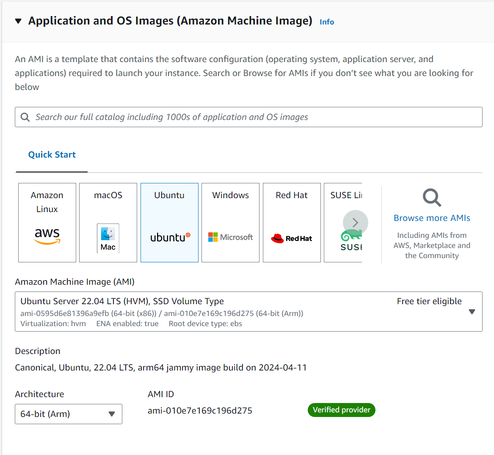

# CS4296-Project

<h2>Step 1:</h2>
<h3>Create a new AWS EC2 instance</h3>

<span>Please select Ubuntu as the operating system, other OS such as Amazon Linux is not supported</span>

<h2>Step 2:</h2>
<h3>SSH remote control to the created AWS EC2 instance</h3>


<h2>Step 3:</h2>
<h3>Create 2 shell scripts which are install_models.sh and eval_models.sh that showed in the repository</h3>

<h2>Step 4:</h2>
<h3>Enter the commnad below:</h3>

```bash
sudo su
```

<h2>Step 5:</h2>
<h3>Enter the command below:</h3>

```bash
chmod 777 install_models.sh
chmod 777 eval_models.sh
```
<h2>Step 6:</h2>
<h3>Enter the command below:</h3>

```bash
source install_models.sh
```

<h2>Step 7:</h2>
<h3>Enter the command below:</h3>

```bash
cd benchmark
python3 install.py tts_angular
cd ..
```

<h2>Step 8:</h2>
<h3>Enter the command below:</h3>

```bash
nano ./benchmark/torchbenchmark/models/nvidia_deeprecommender/nvinfer.py
```
<h3>Modify line 97 from args.use_xpu = torch.xpu.is_available() to args.use_xpu = False</h3>
<h3>Save the file and go back to the original directory</h3>

<h2>Step 8:</h2>
<h3>Enter the command below:</h3>

```bash
source eval_models.sh
```
